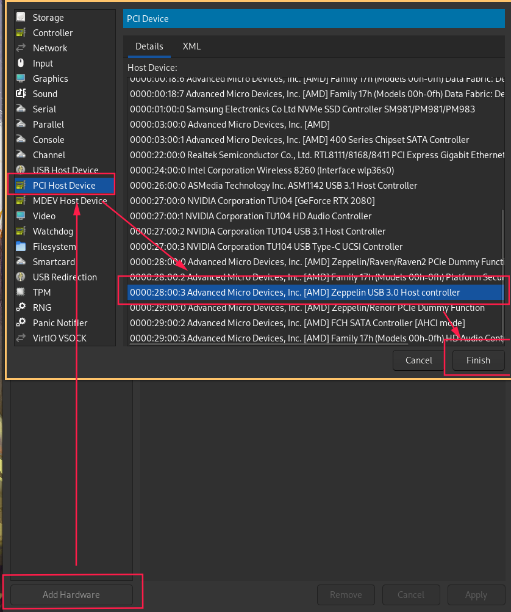
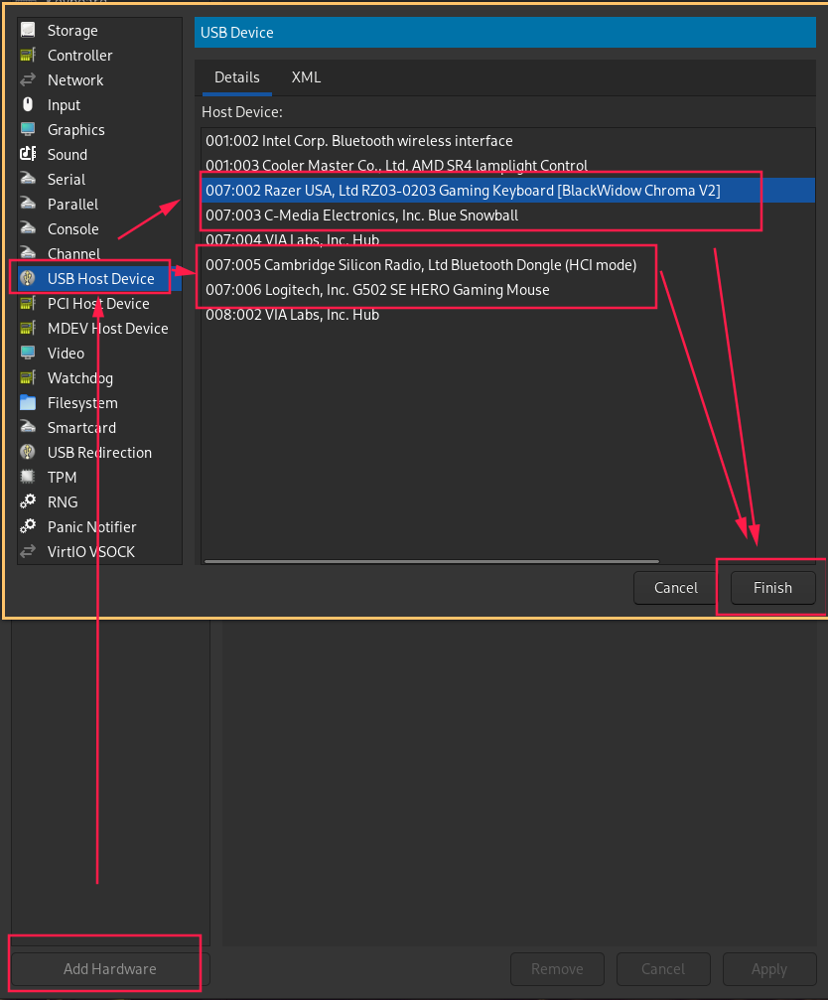

## You have 2 choices to get some input methods on your VM:

 

# Passing through an entire controller
**advantages:**
- Passing the controller itself, it works just like it would normally (plug & play etc)

**inconvenients:**
- Usually doesn't work well on Windows 7 (due to USB 3 drivers)
- Front ports on some PCs don't have the same controller
- May be a bit harder to find in the list if you're not sure what to look for
## How to do it:
 

# Adding individual devices to the VM
**advantages:**
- easy to find and add
- more compatible 
  
**inconvenients:**
- No plug & play
- Have to change the config if you change one of your USB devices
  
## How to do it:
 