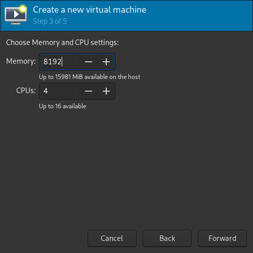

# Requirements
- w10/11 iso
- virt-manager (recommended, again)
- time

# Basic VM Setup:
First, create a VM: 
 

Enter whatever value you want here (half my amount of ram in this case / can do more or less), you can change that later anyway 
 

Use any disk size you want (superior to 60 just in case) 
 

On the last step, make sure to hit "Customize configuration before install" 
 

After that you should be redirected on this screen. 
On firmware, select UEFI x86_64 like in the screenshot **not bios** 
(secboot is needed for Windows 11, technically not for 10 ) 
 

If you're using Windows 11, you **need** to setup the TPM thing. 
 

You can tweak a few parameters if you want, like more CPU cores, but for now we don't need anything more. 

Click on **"Begin Installation"**, and setup windows like you would on a normal computer. 
Once you get on the desktop, shutdown the VM.

# Hooks:
Those will basically hook your graphic card into the VM and and vice versa when you shut it down. 
[Click this before continuing](Global/hooks.md)

# GPU Setup on the VM:
Once the hooks are done, we can finally add our GPU to the VM itself. 

## Remove the included video devices
*red = remove*  
*yellow = optional* 
 

## Add the GPU
Add all of your GPU entries from the IDs you got inside the "hooks" section (1 by 1). 
 

## DONE!!!
At this point your VM is now working (in most cases it should, if not gl lmao) 
You can see the below section if you want your USB ports to work on the VM

# USB devices:
[Make em work](Global/USB.md)
