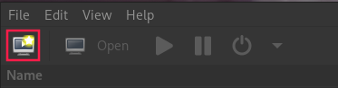
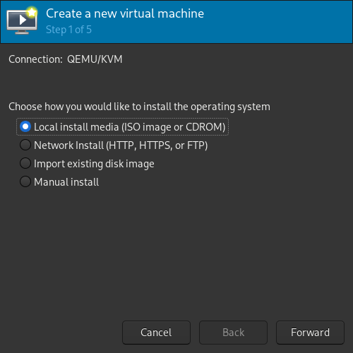
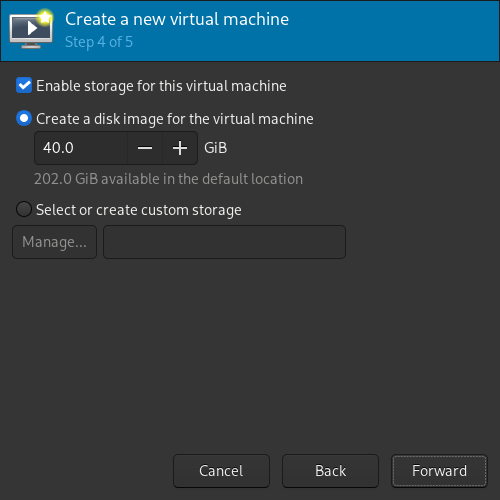

# Requirements
- A working Windows 10/11 ISO
- libvirt + qemu installed
- Virtual Machine Manager (Optional, recommended)

# Basic VM Setup:
First, create a VM: 
 

 

You can change the disk size to whathever you want here 
 

On the last step, make sure to hit "Customize configuration before install" 
 

After that you should have this screen. On firmware, select UEFI x86_64 like in the screenshot (secboot is needed for Windows 11, technically not for 10) 
 

If you're using Windows 11, you **need** to setup a TPM. 
 

You can tweak a few parameters if you want, like more CPU cores, but for now we don't need anything more. 
Click on "Begin Installation", and setup windows like you'd on a normal computer. 
Once you're done installing, shutdown the VM.

# Hooks:
[See this page on how to setup hooks](Global/hooks.md)

# GPU Setup on the VM:
Once the hooks are done, we can finally add the GPU to the VM itself. 

## Remove the included video devices
*red = remove, yellow = optional* 
 

## Add the GPU
Add all of your GPU entries from the IDs you got inside the "hooks" section (1 by 1). 
 

# USB devices:
If you booted up your VM at this point, it should be working but you'll notice you don't have any input method. [You can fix that right here](Global/USB.md)
