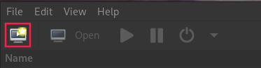
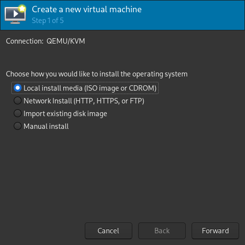
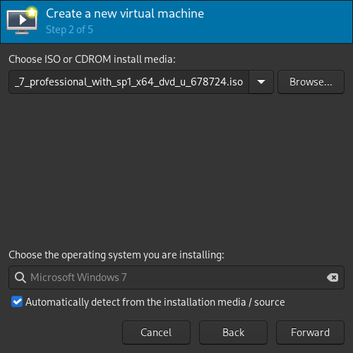
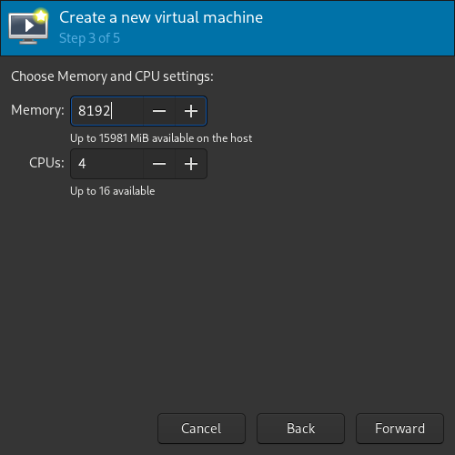
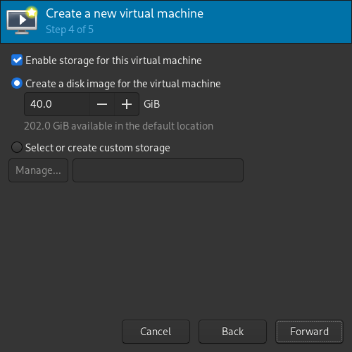
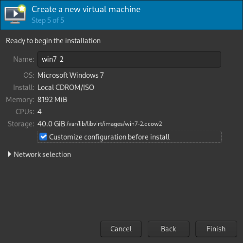
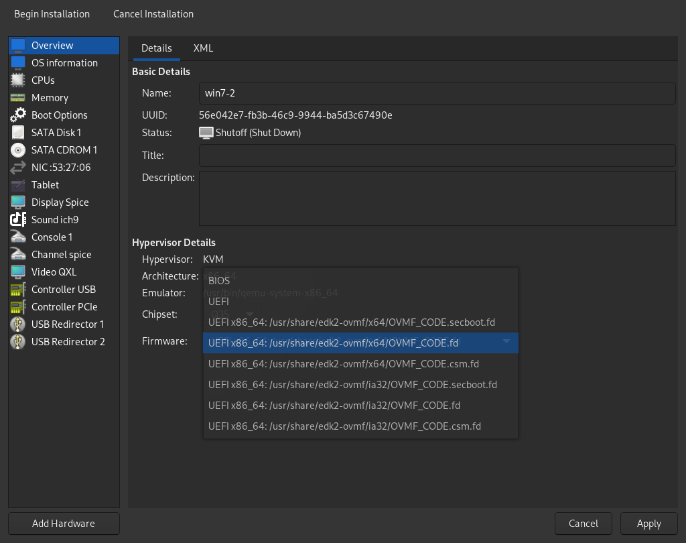

# Requirements
- A working Windows 7 ISO
- Another PC with a VNC Viewer
- [The .iso file from here](https://fedorapeople.org/groups/virt/virtio-win/direct-downloads/archive-virtio/virtio-win-0.1.173-9/)

# Basic VM Setup:
First, create a VM:<br>
<br>



<br>

You can change the disk size to whathever you want here<br>
<br>

On the last step, make sure to hit "Customize configuration before install"<br>
<br>

After that you should have this screen. On firmware, select the UEFI x86_64 like in the screenshot<br>
<br>


# VM Configuration

### I won't add a screenshot for everything since it'd be unnecessary, but here are the changes you need to make:
- CPU tab, set vCPU allocation to 1
- disk, set bus to VirtIO
- NIC (network), set device model to virtio
- Display Spice, change to Display VNC
- Add a CD-Rom pointing to the iso file you got in the requirements


# First run

## Installation 
You can now launch the VM. It should boot normally to the installer, don't forget to hit a key when it prompts you to.<br>
When you're at the installer, at the disk step, you'll get an error. Just hit the button to load drivers from a disk, select the disk you added in the previous step and it should automatically find the disk driver (select the win7 one)
## Network Driver
Once you're booted into windows, Open the device manager. Your "ethernet" device should show up with a warning sign. Right click on it and install a driver for it. When it asks you to locate the driver, select "local" and point it to the VirtIO disk (make sure you checked the 'subfolders' option!) You should now have some internet on your VM (if you don't, reboot). While you're at it, take some time to install firefox now.


# Configure Qemu

### IMPORTANT NOTE: this technically decreases security, since it'll run qemu as root, but oh well. There's a way to make it work without that, but i'm still having trouble making it work.

Edit `/etc/libvirt/qemu.conf` and add those lines on top:

```sh
dynamic_ownership = 0
user = "+0"
```


# Hooks:
[See this page on how to setup hooks](Global/hooks.md)


# Add the GPU to the VM
### Note: don't apply before you've done everything, or libvirt will remove some parts

replace the 1st line:
```xml
<domain type="kvm">
```
with:
```xml
<domain xmlns:qemu="http://libvirt.org/schemas/domain/qemu/1.0" type="kvm">
```
next, go down all the way. You'll find those two tags:
```xml
  </devices>
</domain>
```
We'll add our GPU there. Here's a template on how you do it:
```xml
  </devices>
  <qemu:commandline>
    <qemu:arg value="-device"/>
    <qemu:arg value="vfio-pci,host=27:00.0,id=hostpci0.0,bus=pcie.0,addr=0x10.0,multifunction=on"/>
    <qemu:arg value="-device"/>
    <qemu:arg value="vfio-pci,host=27:00.1,id=hostpci0.1,bus=pcie.0,addr=0x10.1"/>
    <qemu:arg value="-device"/>
    <qemu:arg value="vfio-pci,host=27:00.2,id=hostpci0.2,bus=pcie.0,addr=0x10.2"/>
    <qemu:arg value="-device"/>
    <qemu:arg value="vfio-pci,host=27:00.3,id=hostpci0.3,bus=pcie.0,addr=0x10.3"/>
    <qemu:arg value="-cpu"/>
    <qemu:arg value="host,kvm=off,hv_vendor_id=null"/>
    <qemu:arg value="-machine"/>
    <qemu:arg value="q35,kernel_irqchip=on"/>
  </qemu:commandline>
</domain>
```
Replace the "27:00.0", "27:00.1", etc... with your IDs from the hooks step.<br>
Here i've got 4 different IDs for my graphic card, but if you have more/less you can just add/remove some (except the 1st, all device blocks are the same, just counting up)<br>
As an example, if i have a 5th ID, i'll just have to add:
```xml
    <qemu:arg value="-device"/>
    <qemu:arg value="vfio-pci,host=27:00.4,id=hostpci0.1,bus=pcie.0,addr=0x10.4"/>
```
And if i only have 3, i can just remove lines 9-10 on the example:
```xml
    <qemu:arg value="-device"/>
    <qemu:arg value="vfio-pci,host=27:00.3,id=hostpci0.3,bus=pcie.0,addr=0x10.3"/>
```


# VM final configuration
- Display VNC, set "Adress" to "All interfaces" (can change back after)


# Running the VM
### Before running the VM, make sure to get the local ip of the computer you're making the vm on!
Run the vm. It should hang at some point on your main display.<br>
Now, open up the VNC Client on your 2nd computer, and connect to [ip of computer running]:5900<br>
Download the graphics drivers:
### Nvidia:
> https://www.nvidia.com/en-us/drivers/results/143230/
### AMD:
> use version 20.4.2 of the driver (UNTESTED FOR ME)

Install it.<br>
Once it's done, when it asks you to reboot, click "reboot now", and you should boot back onto the windows 7 desktop on your main PC with your GPU. At this point, you're pretty much done!


# Few tweaks
Once all of that's done, you can:
- Add more vCPUs
- Set back the Display VNC Adress to localhost