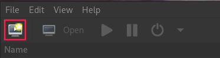
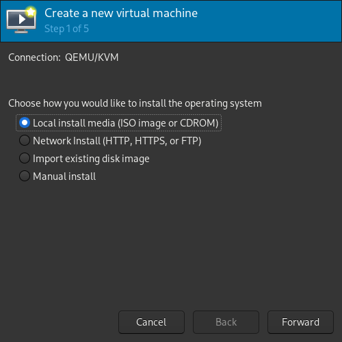
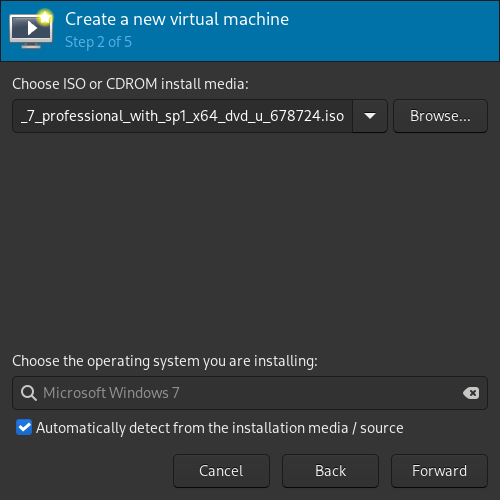
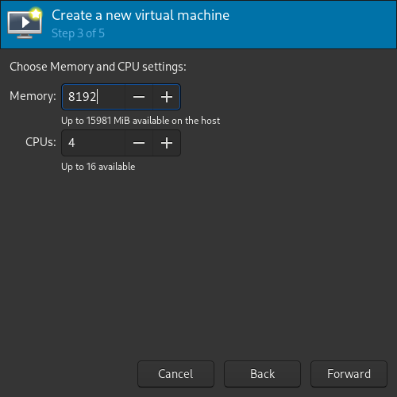
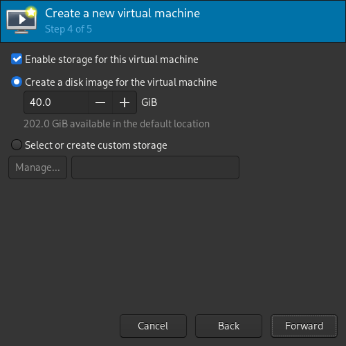
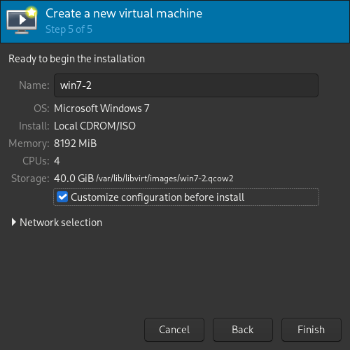
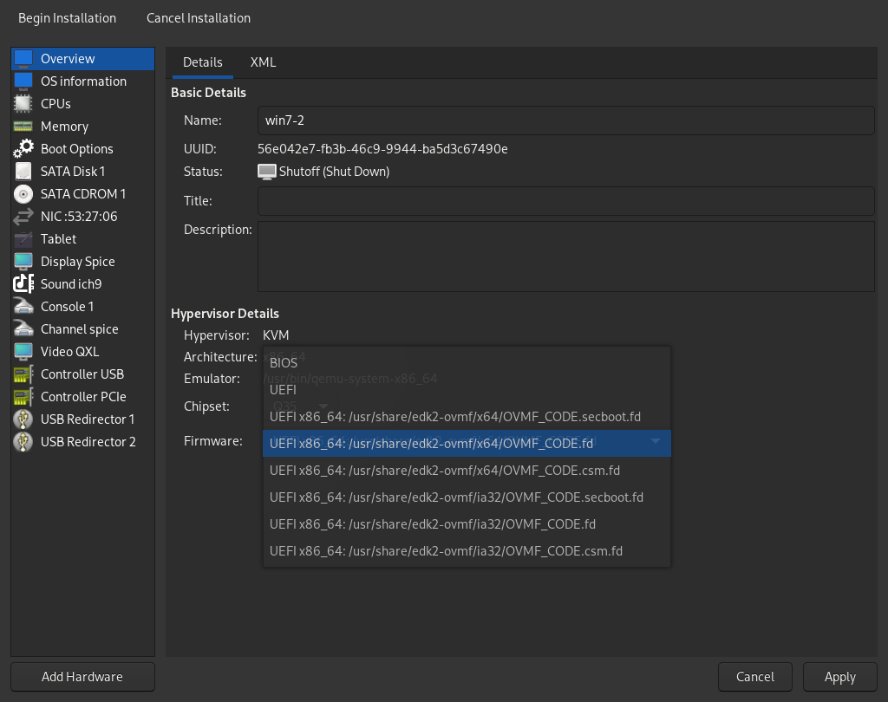

# Requirements
- time
- w7 iso
- another pc or phone with a VNC viewer
- [this iso file](https://fedorapeople.org/groups/virt/virtio-win/direct-downloads/archive-virtio/virtio-win-0.1.173-9/)

# Basic VM Setup:
First, create a VM:<br>
<br>



<br>

Use any disk size you want (superior to 60 just in case)<br>
<br>

On the last step, make sure to hit "Customize configuration before install"<br>
<br>

After that you should be redirected on this screen.<br>
On firmware, select UEFI x86_64 like in the screenshot **not bios**<br>
<br>


# VM Configuration

### I won't add a screenshot for everything since it'd be unnecessary, but here are the changes you need to make:
- CPU tab, set vCPU allocation to 1
- disk, set bus to VirtIO
- NIC (network), set device model to **virtio**
- change to Display Spice to Display VNC 
- Add a CD-Rom pointing to the iso file you got in the requirements


# First run

## Installation 
You can now launch the VM. It should boot normally to the installer, don't forget to hit a key when it prompts you to.<br>
When you're on the installer screen, at the disk step, you'll get an error. Hit the button to load drivers from a disk, select the disk you added in the previous step and it should automatically find the disk driver (select the win7 one)
## Network Driver
Once you're booted into windows, Open the device manager. Your "ethernet" device should show up with a warning sign. Right click on it and choose "install a driver" or whatever its called. When it asks you to locate the driver, select "local" and point it to the VirtIO disk (**make sure you checked the 'subfolders' option!**) You should now have internet access on your VM (if it's not the case, reboot). While you're at it, take some time to install a web browser (firefox).


# Configure Qemu

### IMPORTANT NOTE: this technically decreases security (but do we care?), since it'll run qemu as root. There's a way to make it work without obliterating security but lol lazy fuck.

Edit `/etc/libvirt/qemu.conf` and add those lines on top:

```sh
dynamic_ownership = 0
user = "+0"
```


# Hooks:
Those will basically hook your graphic card into the VM and and vice versa when you shut it down.<br>
[Click this before continuing](Global/hooks.md)


# Add the GPU to the VM
Once the hooks are done, we can finally add our GPU to the VM itself.<br>
### Note: DON'T apply unless you've done everything, or libvirt will remove some parts 

replace the 1st line:
```xml
<domain type="kvm">
```
with:
```xml
<domain xmlns:qemu="http://libvirt.org/schemas/domain/qemu/1.0" type="kvm">
```
next, go down all the way. You'll find those two tags:
```xml
  </devices>
</domain>
```
We'll add our GPU there. Use this template to do it:
```xml
  </devices>
  <qemu:commandline>
    <qemu:arg value="-device"/>
    <qemu:arg value="vfio-pci,host=27:00.0,id=hostpci0.0,bus=pcie.0,addr=0x10.0,multifunction=on"/>
    <qemu:arg value="-device"/>
    <qemu:arg value="vfio-pci,host=27:00.1,id=hostpci0.1,bus=pcie.0,addr=0x10.1"/>
    <qemu:arg value="-device"/>
    <qemu:arg value="vfio-pci,host=27:00.2,id=hostpci0.2,bus=pcie.0,addr=0x10.2"/>
    <qemu:arg value="-device"/>
    <qemu:arg value="vfio-pci,host=27:00.3,id=hostpci0.3,bus=pcie.0,addr=0x10.3"/>
    <qemu:arg value="-cpu"/>
    <qemu:arg value="host,kvm=off,hv_vendor_id=null"/>
    <qemu:arg value="-machine"/>
    <qemu:arg value="q35,kernel_irqchip=on"/>
  </qemu:commandline>
</domain>
```
Replace the "27:00.0", "27:00.1", etc... with your IDs from the hooks step.<br>
Here i've got 4 different IDs for my graphic card, but if you have more/less you can just add or remove some (except the 1st, all device blocks are the same, just counting up)<br>
As an example, if I have a 5th ID, I'll just have to add:
```xml
    <qemu:arg value="-device"/>
    <qemu:arg value="vfio-pci,host=27:00.4,id=hostpci0.1,bus=pcie.0,addr=0x10.4"/>
```
And if I only have 3, I can just remove lines 9-10 on the example:
```xml
    <qemu:arg value="-device"/>
    <qemu:arg value="vfio-pci,host=27:00.3,id=hostpci0.3,bus=pcie.0,addr=0x10.3"/>
```


# VM final configuration
- On VirtManager, edit the Display VNC and set "Adress" to "All interfaces" (can change back after)


# Running the VM
### Before running the VM, make sure to note the local ip of your host machine!
Run the vm. It should hang at some point on your main display.<br>
Now, open up the VNC Client on your 2nd computer or phone, then use this ip [host ip]:5900<br>
Download and install the graphics drivers:
### Nvidia:
> https://www.nvidia.com/en-us/drivers/results/143230/
### AMD:
> use version 20.4.2 of the basic driver OR latest version of pro driver which still supports windows 7 (you'll not be able to use radeon replay etc)
> only if the previous option did not worked, use nimez drivers as an emergency solution (and cap some values like the clock speed with afterburner if you're planning on playing games, else the driver will just crash at any moment cause it maximizes performances at the cost of stability)

Once it's done, when it asks you to reboot, click "reboot now", you should now boot back and your monitor will work. At this point, you're pretty much done!<br>


# Few tweaks
Once all of that's done, you can:
- Add more vCPUs
- Set back the Display VNC Adress to localhost